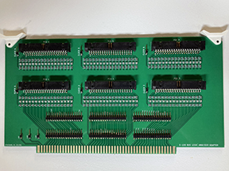

## An S-100 bus logic analyzer adapter board.

#### Description

This is an S-100 bus logic analyzer adapter board.
It simplifies the connection of common 40-pin pod cables like
those for older Agilent/Keysight logic analyzers to the S-100 bus.

Features:
- Test points for all S-100 bus signals.
- Test points for logic analyzer clock inputs and unused channels.

See the Keysight document, [Probing Solutions for Logic Analyzers](https://www.keysight.com/us/en/assets/7018-06707/data-sheets/5968-4632.pdf), for more information on the pod interface.

Note that the photo is of the prototype board. The design files are Rev. A,
and have some changes based on my experience with the prototype board.

Revision A Changes:
- Surface mount components moved to back of board to provide connector clearance.
- Location of pod connectors adjusted to provide more clearance to each other
and to the card ejectors.
- Added test points for unused logic analyzer channels.
- Silkscreen for test points moved for clearance.

#### Logic Analyzer Adapter Design Files

The revision A logic analyzer adapter design files in KiCad 7 are in the kicad directory.

The generated revision A logic analyzer adapter Gerber and drill files are in the file
la-adapter-gerbers.zip.

The bill of materials is in the bom directory.
